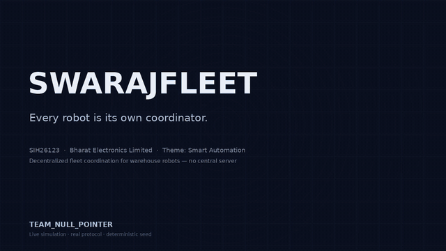
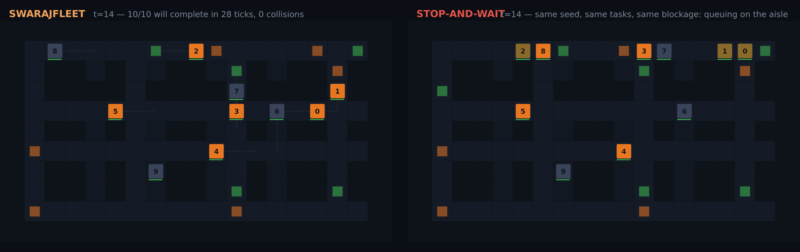

# SwarajFleet

**Every robot is its own coordinator.**

A decentralized, peer-to-peer coordination protocol for autonomous mobile robots (AMRs) in dense warehouses. **One broadcast decides motion _and_ task - no token, no bid, no central search.**

|                  |                                                                                                                            |
| ---------------- | -------------------------------------------------------------------------------------------------------------------------- |
| **Built for**    | Smart India Hackathon 2026 - PS **SIH26123** (Bharat Electronics Limited), Theme: _Smart Automation_, Category: _Software_ |
| **Team**         | Team_Null_Pointer - 6 members                                                                                              |
| **Status**       | Working prototype - benchmarked (180 runs + 240-run scale lock to 50 robots), demoed live, fully deterministic             |
| **Dependencies** | **None** - pure Python standard library (3.10+)                                                                            |

## Demo

**The 70-second demo, playing right here in the README** (animated preview below):



**▶ Play the full 70-second demo in your browser:** [demo player on GitHub Pages](https://shinnok-build.github.io/SwarajFleet/demo.html) · [direct MP4 download](media/SIH26123-DEMO.mp4) (5.3 MB, 720p60)

_Extended 2:30 production cut (judge version): [SIH26123-DEMO-V2-FINAL.mp4](https://drive.google.com/file/d/1jHoNdFgt1OV6nUBTk48FBqe3MesRSRH6/view) - hosted on the team drive._

[Live simulation - runs in your browser](#live-simulation-github-pages) · [Live demo](#live-demo) · [Benchmark report](docs/BENCHMARK-REPORT.md) · [Architecture & design](docs/ARCHITECTURE.md)

---

## The problem

The problem statement names it: as AMR fleets grow, the **central coordinator becomes the bottleneck** - latency, dead zones, a single point of failure. The PS therefore mandates peer-to-peer position + intended-path sharing with **no central coordinator**, and its hard case is _conflict and deadlock at narrow aisles, choke points, and blocked intersections_.

We measured the failure the PS describes:

- Textbook stop-and-wait, given **perfect information**, completes **6%** of dense runs and deadlocks **94%** at 10 robots (90 seeded trials - this repo, `proto/`).
- Centralized MAPF on **real robots**: success falls **68% → 35%** between 8 and 10 agents ([arXiv:2501.17661](https://arxiv.org/abs/2501.17661)) - the coordinator is the bottleneck, measured on physical robots.
- Every decentralized alternative still pays a round: token-passing (TPTS) circulates a global token over all-to-all comms; auctions run multi-round bids; current SOTA (PRISM, [arXiv:2505.08025](https://arxiv.org/abs/2505.08025)) documents exactly the narrow-passage, constrained-communication regime where global-state designs degrade.

## The idea

Every tick, each AMR **broadcasts one message** - `{position, 2-step intent, task state, priority}` - and every robot then decides **locally, simultaneously** from that same snapshot:

1. **TASK GATE** - claims and releases from the _same_ snapshot: allocation costs **zero extra messages**
2. **PERCEIVE** - local snapshot of neighbors (communication radius; no global state)
3. **PLAN** - congestion-aware A\* (cell cost = base + λ · observed intent heat)
4. **CONFLICT?** - **YES:** yield to a proven-free pocket, or the right-of-way order decides (watchdog > carry > rotating), then re-plan around the block - **NO:** commit
5. **APPLY** - pick/drop holds on arrival; never enter an occupied cell
6. **DASHBOARD** - subscribes, **observe-only** (kill-tested: the fleet finishes without it)

Liveness is **by construction**, not by hope: a unique total order per contested tick (no ties possible) + every yield proves a free cell + a watchdog (30 ticks, temporary top priority) bounds any stall. Measured result: **0/90 dense-run deadlocks at 10 robots**.

## Results - measured, not projected

Method: 3 warehouse layouts × 30 fixed seeds × {5, 10} robots; pickup/delivery task world with timed blocked intersections (the PS hard case); the baseline is a **faithful stop-and-wait with full view** (not a strawman); collisions are checked by an **independent detector outside the protocol**. Full numbers: [docs/BENCHMARK-REPORT.md](docs/BENCHMARK-REPORT.md). Scale runs (20/50 robots, 240 runs) use the identical method — table below.

| Metric (10 robots, 90 runs)                     | SwarajFleet                                            | Stop-and-wait (full view) |
| ----------------------------------------------- | ------------------------------------------------------ | ------------------------- |
| Dense runs that complete all tasks              | **90/90 (100%)**                                       | 5/90 (6%)                 |
| Dense deadlocks                                 | **0/90**                                               | 85/90 (94%)               |
| Head-to-head task time (matched trials)         | **28–61% faster**                                      | -                         |
| Collisions (all 180 runs, both systems)         | **0**                                                  | 0                         |
| Forced task re-assignments per dense trial      | **0**                                                  | 4–5                       |
| Full protocol tick (pure Python, commodity CPU) | **~0.5 ms** - ~200× headroom vs a 100 ms control cycle | -                         |

**Scale lock - 20 & 50 robots** (`make bench-scale`, 240 runs, deterministic): same method on a 21×35 scale warehouse (72 docks) + 20 robots on locked layout B.

| Metric (30 trials each)                       | SwarajFleet       | Stop-and-wait (full view) |
| --------------------------------------------- | ----------------- | ------------------------- |
| Worlds completed @20 (scale / locked-B)       | **24/30 / 21/30** | 0/30 / 0/30               |
| Tasks completed @50 (of 1500)                 | **1479 (98.6%)**  | 418 (28%)                 |
| Collisions (all 240 scale runs, both systems) | **0**             | 0                         |

PS success bar - _≥20% faster than stop-and-wait on overlapping paths_: **met (28–61%)**.
Known residual, disclosed: 2/90 at 5 robots (corner cycles, watchdog-bounded) — see [ARCHITECTURE §6](docs/ARCHITECTURE.md#6-known-limits--roadmap).

**PS-compliant stress proofs** (`python3 proto/stress_runs.py`, deterministic, asserted in CI):

| PS sentence                                                                      | Locked scenario                                                                                                                    | Result                                                                                                                                             |
| -------------------------------------------------------------------------------- | ---------------------------------------------------------------------------------------------------------------------------------- | -------------------------------------------------------------------------------------------------------------------------------------------------- |
| _Background: "Wi-Fi dead-zone vulnerabilities … single-point-of-failure risks"_  | 10 robots, 1 robot's broadcast frozen 30 ticks mid-run (peers keep last-known state; onboard sensor-stop backstops the blind spot) | **0 collisions, 10/10 tasks, +13 ticks** (20 local safety stops, all counted)                                                                      |
| _Req. 3: "re-assigning pickup points … if one robot encounters a blocked aisle"_ | task-0 pickup cell blocked 40 ticks                                                                                                | **1 re-assignment (a4→a5, tick 32), 10/10 tasks, 0 collisions** - same world, stop-and-wait: **442 re-assign flaps, 2 tasks lost, never finishes** |

## Quick start

**Nothing to install** - pure standard library.

```bash
# 1) run the full benchmark (deterministic, fixed seeds)
python3 proto/swaraj.py            # → proto/results.json

# 2) run the live demo
python3 demo/server.py             # → http://localhost:8321

# 3) run the invariant smoke test (5 invariants, incl. dead-zone + re-assignment)
python3 tests/test_smoke.py

# 4) 3-robot PS-minimum config (the PS says "at least 3 AMRs")
python3 proto/bench3.py            # → proto/results3.json

# 5) one-command reproducibility: re-run all three benchmarks,
#    confirm every committed number is bit-for-bit identical from seed
make verify

# 4) run the browser simulation's headless engine tests (needs Node)
node tests/site/engine.test.js
node tests/site/crosscheck.js
```

Or with make: `make benchmark` · `make stress` · `make bench3` · `make bench-scale` · `make verify` · `make demo` · `make test` · `make site-test` · `make test-all`.

## Live simulation (GitHub Pages)



A single, self-contained web page - [site/index.html](site/index.html) - that runs the **actual protocol 100% in the browser**. No server, no build step, no dependencies: it is a faithful JavaScript port of `proto/swaraj.py`, verified to reproduce the Python reference **world-for-world** on 72 seeded worlds (see `tests/site/crosscheck.js`). The 70-second demo video is also hosted here: [site/demo.html](site/demo.html).

What it does:

- **Split-screen, lockstep**: stop-and-wait (full view) vs SwarajFleet on the _identical_ world - same seed, same tasks, same blocked intersection.
- **Live controls**: layout (A/B/C), fleet size (3/5/10), seed, speed, single-step.
- **Kill-dashboard proof, in-page**: the "KILL DASHBOARD" button tears down every readout while the fleet keeps running — the dashboard is observe-only.
- **Honest failure states**: the baseline deadlocks and freezes on most dense seeds; SwarajFleet completes, and the rare residual livelock the protocol can have is shown, not hidden.

Because it is static, it deploys to **GitHub Pages** automatically. On your first push, set `Settings → Pages → Source → GitHub Actions`; after that every push to `main` re-deploys and the simulation goes live at `https://<your-username>.github.io/swarajfleet/`. The deploy job is gated on the headless engine tests, so a broken simulation cannot ship.

**Site not live? Check these four things:**

1. The repo root itself contains `site/`, `media/`, and `.github/workflows/pages.yml` - no extra nested folder inside the repo.
2. `Settings → Pages → Build and deployment → Source` = **GitHub Actions** (not "Deploy from a branch").
3. Your latest commit is on branch `main`, and the **Actions** tab shows a green run of "Deploy simulation to GitHub Pages".
4. The repo is **public** - a private repo makes the Pages link private too, so judges could not open the QR link.

## Live demo

Split-screen: **stop-and-wait vs SwarajFleet on the same seed**, live at 4 Hz - with the **kill-dashboard proof**: the dashboard is a read-only subscriber, and killing it mid-run never affects the fleet. There is no server process to kill, because there is no server.

## Architecture

Per-tick workflow, the five invariants, the liveness argument, the A/B experiment we ran on a "smarter" priority scheme, and the known limits: **[docs/ARCHITECTURE.md](docs/ARCHITECTURE.md)**.

## Project structure

```
swarajfleet/
├── proto/                  # simulator + protocol (the project core)
│   ├── sim.py              #   world, shared task layer, baseline, safety layer
│   ├── swaraj.py           #   the SwarajFleet protocol + benchmark harness
│   ├── stress_runs.py      #   PS stress proofs (dead-zone + forced re-assignment)
│   ├── bench3.py           #   3-robot PS-minimum config ("at least 3 AMRs")
│   ├── results.json        #   committed benchmark output (deterministic)
│   ├── results_stress.json #   committed stress-proof output (deterministic)
│   └── results3.json       #   committed 3-robot output (deterministic)
├── site/
│   ├── index.html          # single-file live simulation (faithful JS port; GitHub Pages)
│   ├── demo.html           # demo video player page (GitHub Pages)
│   └── SIH26123-DEMO.mp4   # 70 s demo video, served by Pages (720p60)
├── demo/                   # live web demo (stdlib-only SSE server + vanilla JS)
├── tests/
│   ├── test_smoke.py       # Python invariants (5, runs in CI)
│   └── verify_results.py   # `make verify` - every committed number reproduces from seed
│   └── site/               # headless tests for the browser engine (run in CI)
│       ├── engine.test.js  #   0 collisions, completion, determinism
│       ├── crosscheck.js   #   JS engine vs Python reference on 72 identical worlds
│       └── fixtures/       #   world specs + Python results (regenerable)
├── docs/
│   ├── BENCHMARK-REPORT.md # full locked results + methodology
│   └── ARCHITECTURE.md     # design document
├── media/                  # demo video (70 s) + GIF preview + poster
├── Makefile
└── .github/workflows/
    ├── ci.yml              # Python + browser-engine test jobs
    └── pages.yml           # deploys site/ to GitHub Pages (gated on tests)
```

## Testing & CI

Three layers, all running automatically in CI (`.github/workflows/ci.yml`) on every push and PR:

- **`tests/test_smoke.py`** (Python) - the invariants that matter: zero collisions, full completion (no deadlock), determinism (same seed => same result), **Wi-Fi dead-zone survival** (30-tick broadcast freeze → 0 collisions, all tasks done), and **forced re-assignment** (blocked pickup → re-assign fires, task completes).
- **`tests/site/engine.test.js`** (Node) - the same invariants against the browser engine: zero collisions on every world, completion (modulo the documented residual-livelock set), and determinism.
- **`tests/site/crosscheck.js`** (Node) - faithfulness: the browser engine must reproduce the Python reference protocol **world-for-world** on 72 seeded worlds.

`site/` (the GitHub Pages simulation) is additionally gated: `.github/workflows/pages.yml` re-runs both Node suites and only deploys if they pass.

## Research notes

- The protocol is **A/B-tested, not vibes-tuned**: a goal-distance right-of-way variant was implemented and run on the same 180 seeds - it produced 2 extra deadlocks at 10 robots, so the rotating order ships. The variant stays in `proto/swaraj.py` (`SWARAJ_RO=dist`) as the harness. [ARCHITECTURE §5](docs/ARCHITECTURE.md#5-what-we-tried-and-rejectedab-test)
- Every reference in the benchmark report was read and the exact finding extracted - the citations in [docs/BENCHMARK-REPORT.md](docs/BENCHMARK-REPORT.md) are load-bearing, not decorative.

## References

1. Sharon, Stenger, Cohen, Felner - _Conflict-Based Search (CBS)_, AAMAS 2015 - [paper](https://ojs.aaai.org/index.php/AAAI/article/view/9403)
2. Wurman et al. (Kiva Systems) - _Coordinating Multi-Pick Mobile Robotic Systems_, ICRA 2008 - [paper](https://ieeexplore.ieee.org/document/4609407)
3. Silver - _Cooperative A_ / PIBT\*, 2015 - [paper](http://incompleteideas.net/papers/pibt-2015.pdf)
4. _PM-CBS on real non-holonomic robots_ - arXiv:2501.17661 - [paper](https://arxiv.org/abs/2501.17661)
5. _MET-MAPF_ - ACM 2024 - [paper](https://dl.acm.org/doi/10.1145/3669663)
6. _PRISM - Complete Online Decentralized MAPF_ - arXiv:2505.08025 (2025) - [paper](https://arxiv.org/abs/2505.08025)
7. Smart India Hackathon 2026, PS SIH26123 (BEL) - [problem statement](https://sih.gov.in/sih2026PS)

## Contributing

See [CONTRIBUTING.md](CONTRIBUTING.md). Issues and PRs welcome - the 20/50-robot stress runs and real-hardware porting are the natural next steps.

## License

[MIT](LICENSE) © 2026 Team_Null_Pointer - the protocol module is open-sourced per our post-event commitment.
